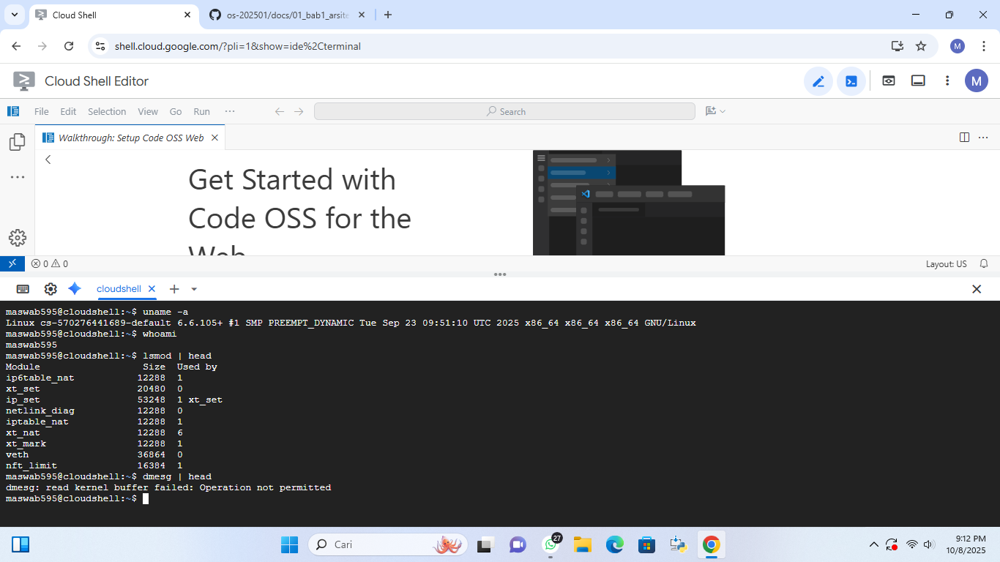

# Laporan Praktikum Minggu 1

---

### Arsitektur Sistem Operasi dan Kernel

---

## Identitas
- **Nama**  : Awwab Maftuhi
- **NIM**   : 250202920  
- **Kelas** : 1 IKRB

---

## Tujuan
   >Setelah menyelesaikan tugas ini, mahasiswa mampu:
1. Menjelaskan peran sistem operasi dalam arsitektur komputer.
2. Mengidentifikasi komponen utama OS (kernel, system call, device driver, file system).
3. Membandingkan model arsitektur OS (monolithic, layered, microkernel).
4. Menggambarkan diagram sederhana arsitektur OS menggunakan alat bantu digital (draw.io / mermaid).

---

## Dasar Teori
1. Arsitektur sistem operasi menentukan cara komponen OS berinteraksi untuk mengatur sumber daya komputer.

2. Monolithic kernel menggabungkan semua layanan inti (driver, file system, manajemen proses) dalam satu ruang kernel sehingga lebih cepat namun kurang aman.

3. Microkernel memisahkan fungsi inti dan layanan tambahan ke ruang pengguna agar sistem lebih stabil dan mudah dikembangkan.

4. Layered architecture membagi OS ke dalam lapisan (layer) yang saling berurutan untuk memudahkan pengelolaan dan pemeliharaan sistem.

5. Perbedaan arsitektur memengaruhi kinerja, stabilitas, dan keamanan sistem operasi yang diuji dalam praktikum.

---

## Langkah Praktikum
1. Langkah-langkah yang dilakukan.  
2. Perintah yang dijalankan.  
3. File dan kode yang dibuat.  
4. Commit message yang digunakan.

---

## Kode / Perintah

```bash
uname -a
lsmod | head
dmesg | head
```

---

## Hasil Eksekusi
Sertakan screenshot hasil percobaan atau diagram:


---

## Analisis
   - Kode "uname -a" adalah kode untuk menampilkan semua informasi yang ada di sistem.
   - Kode " whoami " adalah kode untuk menampilkan semua user  di sistem yang sedang login.
   - Kode" lsmode | head " adalah kode untuk menampilkan 10 baris pertama dari daftar modul kernel aktif.
   - Kode "dmesg | head " adalah kode untuk menampilkan 10 pesan pertama setelah sistem aktif. 

- Kaitan antara hasil dengan teori kernel,panggilan sistem(system call),dan arsitektur sistem operasi:
Hasil eksperimen menunjukkan cara kernel mengatur sumber daya seperti CPU,memori,dan proses.Kegiatan seperti membaca file atau menjalankan program dilakukan melalui sistem panggilan,yang berfungsi sebagai penghubung antara aplikasi dan kernel. Kinerja atau efisiensi sistem dapat dipengaruhi oleh arsitektur OS yang diterapkan.Apakah monolitik, microkernel,atau hybrid karena masing-masing berpengaruh pada cara kernel mengelola komunikasi dan pelaksanaan layanan.Singkatnya,hasil menunjukkan penerapan nyata dari teori bahwa kernel mengelola sistem,system call berfungsi sebagai penghubung antara aplikasi dan kernel,serta arsitektur OS memengaruhi efisiensi dan kestabilan kinerja sistem.

- Perbedaan hasil dalam lingkungan OS (Linux vs Windows):
Perbedaan muncul akibat rancangan kernel,cara pemanggilan sistem,dan pengelolaan sumber daya.
Linux menggunakan kernel monolitik,semua layanan utama beroperasi langsung di kernel sehingga proses menjadi lebih cepat dan efisien.
Windows menerapkan kernel hibrida,beberapa layanan diisolasi di mode pengguna supaya lebih aman dan stabil,namun sedikit lebih lambat.
Panggilan sistem di Linux lebih mudah dan cepat, sedangkan di Windows lebih rumit dengan lapisan keamanan ekstra.
Dalam pengujian kinerja,Linux sering kali lebih baik dalam multitasking,pengelolaan CPU/memori,dan pelaksanaan proses,sedangkan Windows lebih unggul dalam stabilitas dan kesesuaian aplikasi.
---

## Kesimpulan


Dari hasil praktikum,dapat disimpulkan bahwa sistem operasi memiliki peran penting sebagai penghubung antara pengguna,perangkat lunak,dan perangkat keras.Melalui komponen seperti kernel dan system call,sistem operasi mengatur jalannya proses,pembagian memori,serta penggunaan sumber daya komputer agar berjalan efisien.Praktikum juga menunjukkan bahwa perbedaan arsitektur OS (seperti Linux dan Windows) memengaruhi kinerja dan cara sistem menangani tugas.Dengan demikian,pemahaman terhadap konsep dan mekanisme kerja sistem operasi sangat penting untuk mengoptimalkan penggunaan komputer secara efektif.

---

## Quiz
1. Sebutkan tiga fungsi utama sistem operasi?

   **Jawaban:** Management resourch,Management process,dan User Interface. 
2. Jelaskan perbedaan antara kernel mode dan user mode?

   **Jawaban:** Kernel mode memiliki akses penuh ke seluruh sumber daya sistem,digunakan oleh sistem operasi.Sedangkan 
user mode itu memiliki akses terbatas,digunakan oleh program pengguna agar sistem tetap aman dan stabil.

3.  Sebutkan contoh OS dengan arsitektur monolithic dan microkernel!
 
      **Jawaban:** Monolithic: Linux, MS-DOS, UNIX
Microkernel: Minix, QNX, macOS (bagian inti: XNU)

---

## Refleksi Diri
Tuliskan secara singkat:
   - Apa bagian yang paling menantang minggu ini? 

      Sejujurnya saya agak tersiksa dengan matkul satu ini karena saya mendengar dari kakak tingkat bahwa materi yang ada didalamnya bukan untuk mahasiswa semester awal.Dan saya juga agak stress dengan projek yang belum say pahami.Sering kena error,salah ketik kode,dll.

- Bagaimana cara anda mengatasinya?

   Saya sering berkonsultasi dengan teman dan ketika saya stress,saya lampiaskan ke game.


---

**Credit:**  
_Template laporan praktikum Sistem Operasi (SO-202501) – Universitas Putra Bangsa_
