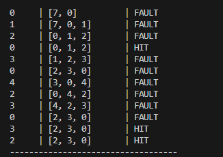
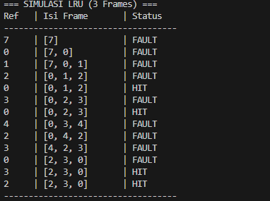

# Laporan Praktikum Minggu 10
Topik: Manajemen Memori – Page Replacement (FIFO & LRU)

---

## Identitas
- **Nama**  : Awwab Maftuhi  
- **NIM**   : 250202920  
- **Kelas** : 1 IKRB

---

## Tujuan
Setelah menyelesaikan tugas ini, mahasiswa mampu:
1. Mengimplementasikan algoritma page replacement FIFO dalam program.
2. Mengimplementasikan algoritma page replacement LRU dalam program.
3. Menjalankan simulasi page replacement dengan dataset tertentu.
4. Membandingkan performa FIFO dan LRU berdasarkan jumlah *page fault*.
5. Menyajikan hasil simulasi dalam laporan yang sistematis.
---

## Dasar Teori
   
   1. **Konsep Dasar**

      Page replacement terjadi saat sistem kehabisan frame memori fisik(RAM) untu menampung halaman yang baru yang diminta dalam proses. Sistem harus memilih satu halaman yang sudah ada di RAM untuk dikeluarkan agar bisa digantikan oleh halaman baru yang dibutuhkan.

      - Page refult : Kegagalan saat data tidak ditemukan di RAM.
      - Frame : Tempat penyimpanan fisik di dalam RAM.
   2. **Algoritma FIFO(First-In, First-Out)**
      - Prinsip : Halaman yanag paling awal masuk ke memori akan menjadi yang pertama kali dikeluarkan.
      - _Kelebihan_ : Sangat mudah diimplementasikan (menggunakan antrean)
      - _Kekurangan_ : Tidak mempertimbangkan seberapa serinng halaman tersebut digunakan. Dapat mengalami *BELADY'S ANOMALY* 
---
---

## Langkah Praktikum
1. **Menyiapkan Dataset**

   Gunakan *reference string* berikut sebagai contoh:
   ```
   7, 0, 1, 2, 0, 3, 0, 4, 2, 3, 0, 3, 2
   ```
   Jumlah frame memori: **3 frame**.

2. **Implementasi FIFO**

   - Simulasikan penggantian halaman menggunakan algoritma FIFO.
   - Catat setiap *page hit* dan *page fault*.
   - Hitung total *page fault*.

3. **Implementasi LRU**

   - Simulasikan penggantian halaman menggunakan algoritma LRU.
   - Catat setiap *page hit* dan *page fault*.
   - Hitung total *page fault*.

4. **Eksekusi & Validasi**

   - Jalankan program untuk FIFO dan LRU.
   - Pastikan hasil simulasi logis dan konsisten.
   - Simpan screenshot hasil eksekusi.

5. **Analisis Perbandingan**

   Buat tabel perbandingan seperti berikut:

   | Algoritma | Jumlah Page Fault | Keterangan |
   |:--|:--:|:--|
   | FIFO | ... | ... |
   | LRU | ... | ... |


   - Jelaskan mengapa jumlah *page fault* bisa berbeda.
   - Analisis algoritma mana yang lebih efisien dan alasannya.

6. **Commit & Push**

   ```bash
   git add .
   git commit -m "Minggu 10 - Page Replacement FIFO & LRU"
   git push origin main
---


---

## Hasil Simulasi

1. **FIFO**



2. **LRU**


---

## Pengerjaan Praktikum

### 1. Dataset
   
   **Reference String:** 7, 0, 1, 2, 0, 3, 0, 4, 2, 3, 0, 3, 2

   **Jumlah Frame Memori:** 3 Frame

---

### 2. Implementasi FIFO (First-In, First-Out)

| Ref | F1 | F2 | F3 | Status | Keterangan |
|:---:|:---:|:---:|:---:|:---:|:---|
| **7** | 7 | | | Fault | Masuk F1 |
| **0** | 7 | 0 | | Fault | Masuk F2 |
| **1** | 7 | 0 | 1 | Fault | Masuk F3 |
| **2** | 2 | 0 | 1 | Fault | 7 diganti (paling lama) |
| **0** | 2 | 0 | 1 | **Hit** | 0 sudah ada |
| **3** | 2 | 3 | 1 | Fault | 0 diganti |
| **0** | 2 | 3 | 0 | Fault | 1 diganti |
| **4** | 4 | 3 | 0 | Fault | 2 diganti |
| **2** | 4 | 2 | 0 | Fault | 3 diganti |
| **3** | 4 | 2 | 3 | Fault | 0 diganti |
| **0** | 0 | 2 | 3 | Fault | 4 diganti |
| **3** | 0 | 2 | 3 | **Hit** | - |
| **2** | 0 | 2 | 3 | **Hit** | - |

**Total Page Fault FIFO: 10**

---

### 3. Implementasi LRU (Least Recently Used)
*Prinsip: Mengganti halaman yang paling lama tidak digunakan di masa lalu.*

| Ref | F1 | F2 | F3 | Status | Keterangan |
|:---:|:---:|:---:|:---:|:---:|:---|
| **7** | 7 | | | Fault | Masuk F1 |
| **0** | 7 | 0 | | Fault | Masuk F2 |
| **1** | 7 | 0 | 1 | Fault | Masuk F3 |
| **2** | 2 | 0 | 1 | Fault | 7 paling lama tidak dipakai |
| **0** | 2 | 0 | 1 | **Hit** | 0 baru digunakan |
| **3** | 2 | 0 | 3 | Fault | 1 paling lama tidak dipakai |
| **0** | 2 | 0 | 3 | **Hit** | 0 baru digunakan |
| **4** | 4 | 0 | 3 | Fault | 2 paling lama tidak dipakai |
| **2** | 4 | 0 | 2 | Fault | 3 paling lama tidak dipakai |
| **3** | 4 | 3 | 2 | Fault | 0 paling lama tidak dipakai |
| **0** | 0 | 3 | 2 | Fault | 4 paling lama tidak dipakai |
| **3** | 0 | 3 | 2 | **Hit** | - |
| **2** | 0 | 3 | 2 | **Hit** | - |

**Total Page Fault LRU: 9**

---

### 4. Analisis Perbandingan

| Algoritma | Jumlah Page Fault | Keterangan |
| :--- | :---: | :--- |
| **FIFO** | 10 | Lebih sederhana, namun kurang efisien karena mengabaikan frekuensi akses. |
| **LRU** | 9 | Lebih optimal karena mempertahankan data yang masih aktif digunakan. |


## Kesimpulan
 Berdasarkan simulasi dengan 3 Frame dan dataset 7, 0, 1, 2, 0, 3, 0, 4, 2, 3, 0, 3, 2:1. 
     
1. **Perbandingan Performa**

   | Algoritma | Total Page Fault | Efisiensi |

   | FIFO | 10 | Buruk (Sering membuang data yang masih dibutuhkan) |

    | LRU9 | Lebih  Baik (Pintar dalam mempertahankan data aktif) |

2. **Mengapa LRU Lebih Unggul?** 

   *(Alasan Tegas)FIFO itu "Buta"* karena:

      FIFO hanya melihat waktu masuk. Ia membuang halaman 0 di langkah ke-6 hanya karena angka 0 sudah lama ada di memori, padahal angka 0 tersebut baru saja digunakan dan akan digunakan lagi sebentar lagi. Ini menyebabkan pemborosan tenaga karena sistem harus memanggil ulang data yang sebenarnya baru saja ada.LRU itu "Pintar": LRU melihat riwayat pemakaian. Ia menyadari bahwa angka 0 masih sering dipakai (populer), maka ia memilih mempertahankan angka 0 dan justru membuang angka lain yang sudah lama tidak disentuh. Strategi ini berhasil menghemat 1 kali proses pengambilan data (save 1 page fault).

3. **Rekomendasi Dalam Kondisi Nyata**

    LRU jauh lebih efisien untuk meningkatkan kecepatan komputer. FIFO memang lebih mudah dibuat kodenya, tapi sering kali menyebabkan sistem terasa lebih lambat karena terlalu sering terjadi Page Fault (bongkar pasang data antara RAM dan Harddisk).

---

## Quiz

1. Apa perbedaan utama FIFO dan LRU?

   **Jawaban :**

    -  FIFO (First-In, First-Out): Mengganti halaman berdasarkan urutan waktu masuk. Halaman yang paling pertama masuk ke memori akan dibuang pertama kali, tanpa peduli halaman tersebut masih sering dipakai atau tidak. Ibarat mengantre: yang datang duluan, keluar duluan.

   - LRU (Least Recently Used): Mengganti halaman berdasarkan riwayat penggunaan. Halaman yang paling lama tidak disentuh atau tidak diakses oleh sistem akan dibuang. Ibarat barang di gudang: barang yang paling jarang dipakai/berdebu akan dibuang lebih dulu, meskipun ia baru saja datang.

2. Mengapa FIFO dapat menghasilkan *Belady’s Anomaly*?

   **Jawaban:**

   Belady’s Anomaly adalah kondisi aneh di mana jumlah frame memori ditambah, tapi jumlah page fault justru makin banyak (bukannya makin sedikit).

   _Penyebabnya:_ Karena FIFO hanya membuang data berdasarkan urutan masuk tanpa peduli seberapa sering data itu dipakai. Saat frame ditambah, pola antrean bisa berubah sedemikian rupa sehingga data yang sebenarnya sering dibutuhkan justru terbuang lebih cepat dari biasanya.

   _Intinya:_ FIFO itu "buta" frekuensi, jadi menambah ruang tidak menjamin kinerjanya makin pintar.


3. Mengapa LRU umumnya menghasilkan performa lebih baik dibanding FIFO?

   **Jawaban:**

   - Prediksi Masa Depan: LRU mengasumsi bahwa data yang baru saja dipakai kemungkinan besar akan dipakai lagi dalam waktu dekat.

   - Mempertahankan Data Aktif: Tidak seperti FIFO yang asal buang data "tua", LRU menjaga data yang masih "populer" tetap di memori.

   - Mengurangi Page Fault: Karena data yang sering diakses jarang dibuang, sistem tidak perlu sering-sering mengambil data dari harddisk (yang lambat), sehingga performa keseluruhan jauh lebih cepat.

---

## Refleksi Diri
Tuliskan secara singkat:
- Apa bagian yang paling menantang minggu ini?  
>Mungkin lebih ke arah laptop saya yang masih sulit adaptasi dengan teknoogi jaman sekarang.
- Bagaimana cara Anda mengatasinya?  
> Hanya berharap semoga bisa mempunyai laptop yang spesifikasinya bisa menyesuaikan dengan arah transformasi digital.

---

**Credit:**  
_Template laporan praktikum Sistem Operasi (SO-202501) – Universitas Putra Bangsa_
