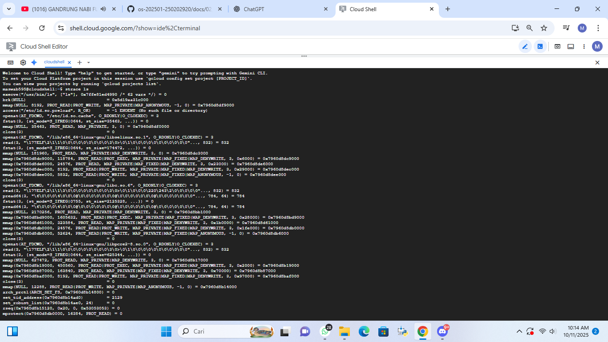
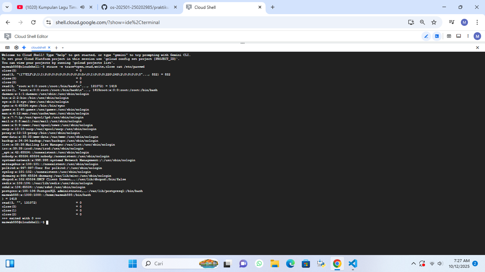
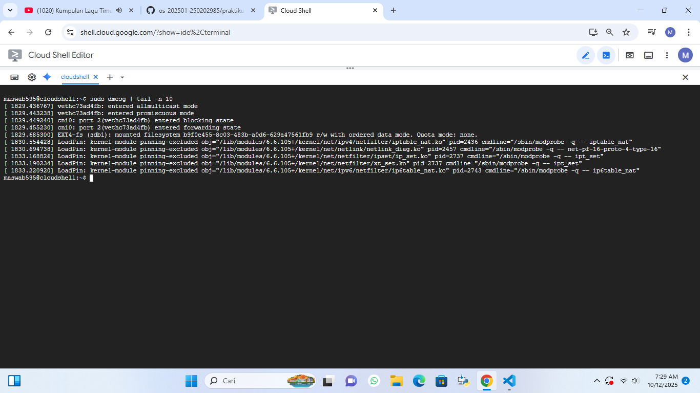

# Laporan Praktikum Minggu 2
Topik: "Struktur Sistem Call dan Fungsi Kernel"

---

## Identitas
- **Nama**  : Awwab Maftuhi
- **NIM**   : 250202920
- **Kelas** : 1 IKRB

---

## Tujuan
Setelah menyelesaikan tugas ini, mahasiswa mampu:
1. Menjelaskan konsep dan fungsi system call dalam sistem operasi.
2. Mengidentifikasi jenis-jenis system call dan fungsinya.
3. Mengamati alur perpindahan mode user ke kernel saat system call terjadi.
4. Menggunakan perintah Linux untuk menampilkan dan menganalisis system cal

---

## Dasar Teori
Pada praktikum minggu ini,mahasiswa akan mempelajari mekanisme system call dan struktur sistem operasi.
System call adalah antarmuka antara program aplikasi dan kernel yang memungkinkan aplikasi berinteraksi dengan perangkat keras secara aman melalui layanan OS.

Mahasiswa akan melakukan eksplorasi terhadap:

Jenis-jenis system call yang umum digunakan (file, process, device, communication).
Alur eksekusi system call dari mode user menuju mode kernel.
Cara melihat daftar system call yang aktif di sistem Linux.

---

## Langkah Praktikum
1. Setup Environment

Gunakan Linux (Ubuntu/WSL).
Pastikan perintah strace dan man sudah terinstal.
Konfigurasikan Git (jika belum dilakukan di minggu sebelumnya).
Eksperimen 1 – Analisis System Call Jalankan perintah berikut:
```bash
strace ls
```
>Catat 5–10 system call pertama yang muncul dan jelaskan fungsinya.
Simpan hasil analisis ke results/syscall_ls.txt.

Eksperimen 2 – Menelusuri System Call File I/O Jalankan:
```bash
strace -e trace=open,read,write,close cat /etc/passwd
```
>Analisis bagaimana file dibuka, dibaca, dan ditutup oleh kernel.


Eksperimen 3 – Mode User vs Kernel Jalankan:
```bash
dmesg | tail -n 10
```
>Amati log kernel yang muncul. Apa bedanya output ini dengan output dari program biasa?


Diagram Alur System Call

Buat diagram yang menggambarkan alur eksekusi system call dari program user hingga kernel dan kembali lagi ke user mode.
Gunakan draw.io / mermaid.
Simpan di:
```bash
praktikum/week2-syscall-structure/screenshots/syscall-diagram.png
```
Commit & Push
```bash
git add .
git commit -m "Minggu 2 - Struktur System Call dan Kernel Interaction"
git push origin main
```
---

## Kode / Perintah
Tuliskan potongan kode atau perintah utama:
```bash
strace ls
strace -e trace=open,read,write,close cat /etc/passwd
dmesg | tail -n 10
```

---

## Hasil Eksekusi
Sertakan screenshot hasil percobaan atau diagram:

 **Eksperimen 1 – Analisis System Call**



**Eksperimen 2 – Menelusuri System Call File I/O**



**Eksperimen 2 – Menelusuri System Call File I/O**



**Tabel Observasi Hasil  `strace ls`**

| No | System Call    | Keterangan                                                   |
| -- | -------------- | ------------------------------------------------------------ |
| 1  | `execve()`     | Menjalankan program `ls` dari shell.                         |
| 2  | `brk()`        | Mengatur batas awal dan akhir memori heap proses.            |
| 3  | `mmap()`       | Memetakan file atau library ke dalam ruang memori virtual.   |
| 4  | `openat()`     | Membuka file atau direktori yang akan diakses oleh `ls`.     |
| 5  | `read()`       | Membaca isi file atau direktori yang telah dibuka.           |
| 6  | `getdents64()` | Mengambil daftar isi direktori (nama-nama file dan folder).  |
| 7  | `fstat()`      | Mengambil informasi status file seperti ukuran dan jenisnya. |
| 8  | `write()`      | Menampilkan hasil pembacaan ke layar terminal (stdout).      |
| 9  | `close()`      | Menutup file descriptor yang sudah tidak digunakan.          |
| 10 | `exit_group()` | Mengakhiri proses program `ls` setelah selesai dieksekusi.   |


---

## Analisis
- Jelaskan makna hasil percobaan.

> strace adalah alat Linux untuk melacak panggilan sistem (system call) dan sinyal yang dijalankan program, berguna mendeteksi kesalahan atau memahami cara kerja aplikasi. Sementara ls berfungsi menampilkan daftar file dan folder di direktori. Dengan strace ls, kita bisa melihat bagaimana perintah ls berinteraksi dengan kernel selama proses eksekusi.

> strace -e trace=open,read,write,close cat /etc/passwd digunakan untuk memantau bagaimana perintah cat berinteraksi dengan sistem saat membaca file /etc/passwd. Dengan opsi -e trace=..., kita hanya melihat empat aktivitas utama: membuka file (open), membaca isinya (read), menulis hasil ke layar (write), dan menutup file (close). Jadi, perintah ini membantu memahami langkah-langkah yang dilakukan cat ketika menampilkan isi file pengguna sistem.

> dmesg | tail -n 10 berfungsi untuk melihat sepuluh pesan terbaru dari log kernel di sistem Linux. Perintah dmesg sendiri menampilkan catatan aktivitas sistem, seperti deteksi perangkat keras, driver, atau error. Tanda | menyalurkan hasilnya ke tail -n 10, yang hanya menampilkan sepuluh baris terakhir. Dengan begitu, kita bisa mengetahui aktivitas atau kejadian terbaru yang terjadi pada sistem secara cepat.


- Hubungkan hasil dengan teori (fungsi kernel, system call, arsitektur OS). 

> Perintah dmesg | tail -n 10 memiliki kaitan langsung dengan konsep fungsi kernel, system call, dan arsitektur sistem operasi.
> Kernel bertugas mengatur komunikasi antara perangkat keras dan perangkat lunak,serta mencatat berbagai aktivitas sistem ke dalam log yang bisa dilihat melalui dmesg.
> Setiap entri log tersebut berasal dari hasil system call, seperti saat sistem mendeteksi perangkat baru,memuat driver, atau menangani kesalahan.
>Dalam kerangka arsitektur OS, perintah ini menunjukkan bagaimana lapisan kernel bekerja di balik layar untuk menanggapi perintah dari user space, kemudian berinteraksi dengan perangkat keras agar sistem berjalan stabil dan responsif.


- Apa perbedaan hasil di lingkungan OS berbeda (Linux vs Windows)?

> Perbedaan hasil antara Linux dan Windows terletak pada cara sistem menampilkan dan mengelola log kernel atau pesan sistem.

> Di Linux,perintah dmesg | tail -n 10 menampilkan langsung pesan dari kernel — seperti deteksi perangkat keras, proses driver,atau error sistem — karena Linux memberi akses terbuka ke kernel ring buffer.

> Di Windows, tidak ada perintah dmesg. Log sistem dikelola oleh Event Viewer, dan informasinya disajikan dalam bentuk antarmuka grafis, bukan terminal.

> Jadi, Linux lebih terbuka untuk pemantauan teknis, sedangkan Windows lebih terkontrol dan berbasis GUI.
---

## Kesimpulan
Melalui praktik tentang struktur syscall dan fungsi kernel,mahasiswa dapat memahami cara kerja sistem operasi dalam menghubungkan pengguna dengan perangkat keras.System call berperan sebagai perantara agar program di user space dapat meminta layanan dari kernel, seperti membaca atau menulis data.Sementara itu,kernel menjalankan permintaan tersebut secara efisien,mengatur sumber daya sistem, serta menjaga keamanan dan stabilitas.Dengan praktik ini,mahasiswa mampu melihat bagaimana proses inti sistem operasi berjalan secara terstruktur dan terkendali.

---

## Quiz

1. Apa fungsi utama system call dalam sistem operasi?

    >  Fungsi utama **system call** dalam sistem operasi adalah menjadi **penghubung antara program pengguna dan kernel**. Melalui mekanisme ini, aplikasi dapat meminta layanan dari sistem, seperti membaca atau menulis file, mengatur memori, membuat proses baru, atau berinteraksi dengan perangkat keras. Tanpa adanya *system call*, program tidak bisa langsung mengakses sumber daya sistem. Dengan demikian, *system call* memastikan proses komunikasi antara aplikasi dan kernel berjalan aman, teratur, serta efisien.


2. Sebutkan 4 kategori system call yang umum digunakan!!

   >    Empat kategori system call yang umum digunakan adalah:

   1.Manajemen Proses

   2.Manajemen File

      3.Manajemen Perangkat

      4.Manajemen Memori 


3. Mengapa system call tidak bisa dipanggil langsung oleh user program?

   >  User program tidak dapat memanggil system call secara langsung karena hal itu berkaitan dengan keamanan dan kestabilan sistem operasi.Kernel memiliki kendali penuh atas sumber daya dan perangkat keras,sehingga jika pengguna bisa mengaksesnya tanpa pembatasan,sistem bisa mengalami gangguan,kerusakan,atau kebocoran data.Oleh sebab itu,sistem operasi menyediakan antarmuka khusus yang memastikan setiap permintaan dari program pengguna diproses dan diverifikasi oleh kernel secara aman serta terkontrol.


---

## Refleksi Diri
Tuliskan secara singkat:
- Apa bagian yang paling menantang minggu ini?  
   > Melawan kantuk ditengah guyuran materi yang seperti baru didengar.Begitu juga dalam hal tugas install linux karena laptop saya belum mumpuni/mampu untuk menginstallnya
- Bagaimana cara Anda mengatasinya?  
   > Ada teman yang merekomendasikan menggunakan pengganti linux yang lebih ringan yaitu cloudshell.
---

**Credit:**  
_Template laporan praktikum Sistem Operasi (SO-202501) – Universitas Putra Bangsa_
