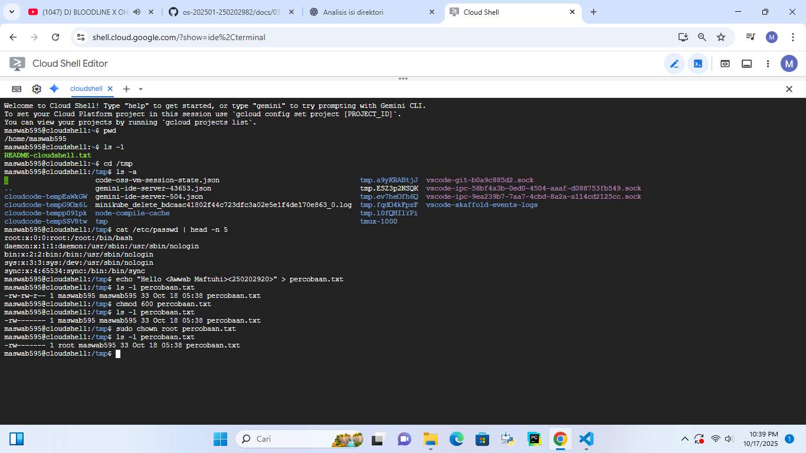
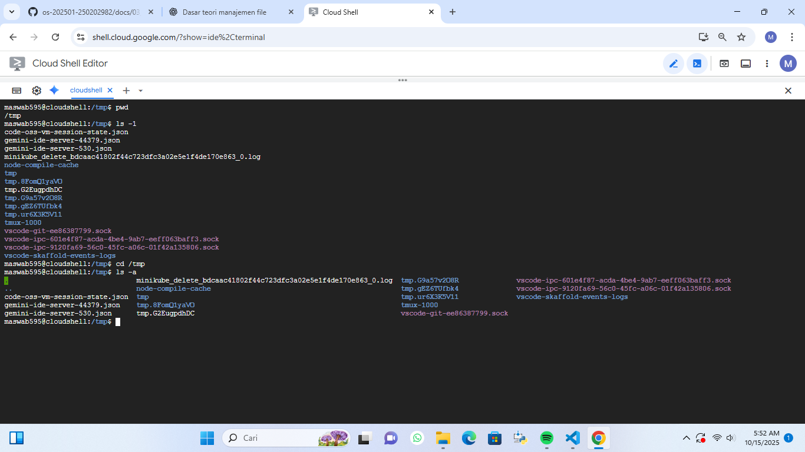
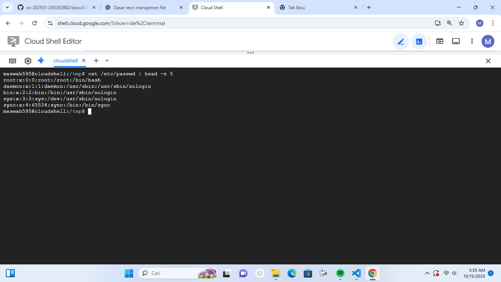
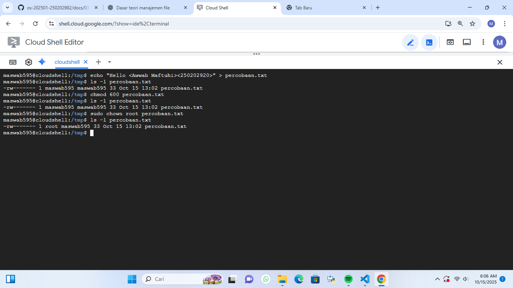

# Laporan Praktikum Minggu 3
Topik: Manajemen File dan Permission di Linux  


---

## Identitas
- **Nama**  : Awwab Maftuhi
- **NIM**   : 2502029
- **Kelas** : 1 IKRB

---

## Tujuan

 **Tujuan utama** dari praktikum ini adalah agar mahasiswa mampu mengoperasikan perintah Linux dasar dengan benar,memahami sistem izin (permission),dan mendokumentasikan hasilnya dalam format laporan Git.

 Setelah menyelesaikan tugas ini, mahasiswa mampu:
1. Menggunakan perintah `ls`, `pwd`, `cd`, `cat` untuk navigasi file dan direktori.
2. Menggunakan `chmod` dan `chown` untuk manajemen hak akses file.
3. Menjelaskan hasil output dari perintah Linux dasar.
4. Menyusun laporan praktikum dengan struktur yang benar.
5. Mengunggah dokumentasi hasil ke Git Repository tepat waktu.

---

## Dasar Teori

Dalam sistem operasi Linux,pengelolaan file dan direktori menjadi aspek dasar yang harus dipahami oleh setiap pengguna.Linux mengatur data dalam bentuk struktur hierarki yang dimulai dari direktori utama (root /).Melalui perintah dasar seperti ls,pwd,cd,dan cat,pengguna dapat menavigasi sistem,menampilkan isi direktori,serta membaca isi file.
Selain itu,Linux menerapkan sistem permission dan ownership untuk menjaga keamanan dan keteraturan akses terhadap file.Perintah chmod digunakan untuk mengatur hak akses(read,write,execute),sedangkan chown berfungsi mengubah kepemilikan file.Pemahaman terhadap konsep ini penting agar pengguna dapat mengelola data dengan aman,efisien,dan sesuai dengan hak akses yang berlaku di lingkungan multi user.


---

## Langkah Praktikum
1. **Setup Environment**
   - Gunakan Linux (Ubuntu/WSL).
   - Pastikan folder kerja berada di dalam direktori repositori Git praktikum:
     ```
     praktikum/week3-linux-fs-permission/
     ```

2. **Eksperimen 1 – Navigasi Sistem File**
   Jalankan perintah berikut:
   ```bash
   pwd
   ls -l
   cd /tmp
   ls -a
   ```
   - Jelaskan hasil tiap perintah.
   - Catat direktori aktif, isi folder, dan file tersembunyi (jika ada).

3. **Eksperimen 2 – Membaca File**
   Jalankan perintah:
   ```bash
   cat /etc/passwd | head -n 5
   ```
   - Jelaskan isi file dan struktur barisnya (user, UID, GID, home, shell).

4. **Eksperimen 3 – Permission & Ownership**
   Buat file baru:
   ```bash
   echo "Hello <NAME><NIM>" > percobaan.txt
   ls -l percobaan.txt
   chmod 600 percobaan.txt
   ls -l percobaan.txt
   ```
   - Analisis perbedaan sebelum dan sesudah chmod.  
   - Ubah pemilik file (jika memiliki izin sudo):
   ```bash
   sudo chown root percobaan.txt
   ls -l percobaan.txt
   ```
   - Catat hasilnya.

5. **Eksperimen 4 – Dokumentasi**
   - Ambil screenshot hasil terminal dan simpan di:
     ```
     praktikum/week3-linux-fs-permission/screenshots/
     ```
   - Tambahkan analisis hasil pada `laporan.md`.

6. **Commit & Push**
   ```bash
   git add .
   git commit -m "Minggu 3 - Linux File System & Permission"
   git push origin main
   ```

---

## Kode / Perintah

```bash
   pwd
   ls -l
   cd /tmp
   ls -a
   cat /etc/passwd | head -n 5
   echo "Hello <NAME><NIM>" > percobaan.txt
   ls -l percobaan.txt
   chmod 600 percobaan.txt
   ls -l percobaan.txt
   sudo chown root percobaan.txt
   ls -l percobaan.txt
```

---

## Hasil Eksekusi
Sertakan screenshot hasil percobaan atau diagram:


---

## Analisis
- Jelaskan fungsi tiap perintah dan arti kolom permission (`rwxr-xr--`)!



   a.Perintah `pwd`

    `pwd` atau Print Working Directory adalah perintah yang berfungsi untuk menampilkan lokasi direktori (folder) tempat kamu sedang bekerja saat ini.Perintah ini penting untuk mengetahui kamu sedang berada di folder mana,terutama saat sering berpindah direktori di terminal.


   b.Perintah `ls -1`

    Berfungsi menampilkan isi folder secara detail dalam format panjang.
    ls sendiri berarti “list” (daftar),dan opsi -l (huruf kecil L) menampilkan informasi tambahan seperti Hak akses (permission),nama pemilik,ukuran file,dan lain-lain.


   c.Perintah `cd /tmp`

      Berfungsi untuk berpindah dari direktori ke folder /tmp.Sedangkan "cd" singkatan dari change directory.Folder /tmp adalah direktori sementara (temporary) di Linux, yang digunakan untuk menyimpan file-file sementara sistem atau aplikasi.


   d.Perintah `ls -a`

      ls -a atau List All Files berfungsi untuk menampilkan semua isi folder,termasuk file tersembunyi.File tersembunyi di Linux biasanya diawali dengan tanda titik (.), misalnya .bashrc atau .config.Kalau kamu hanya pakai ls, file tersembunyi tidak terlihat.Dengan menambahkan opsi -a (all), semua file akan ditampilkan.




   Perintah `cat /etc/passwd | head -n 5`

      Berfungsi untuk menampilkan 5 baris pertama dari isi file sistem /etc/passwd.Perintah ini digunakan untuk menampilkan seluruh isi file /etc/passwd, yaitu file yang berisi data akun pengguna di sistem Linux.
      Setiap baris di file ini mewakili satu user.
      `|` (pipe) digunakan untuk mengalirkan output dari satu perintah ke perintah lain.
      `head -n 5` berarti ambil 5 baris pertama dari hasil output sebelumnya.


  a.Perintah `echo "Hello <NAME><NIM>" > percobaan.txt`
    

      Berarti membuat file baru bernama percobaan.txt dan menuliskan teks "Hello <NAME><NIM>" ke dalamnya.
      `echo`  digunakan untuk menampilkan teks ke terminal.
      Simbol `>`  mengarahkan output dari layar ke file baru.
      Jika file sudah ada, maka isinya akan ditimpa.
      Misalnya kamu menulis:

      echo "Hello <Awwab Maftuhi><250202920>" > percobaan.txt

      Maka isi file akan menjadi:

      Hello <Awwab Maftuhi><250202920>

      Perintah ini menunjukkan bagaimana Linux membuat dan menulis file teks sederhana hanya dengan satu baris perintah.

         
   b.Perintah `ls -l percobaan.txt`

      Berfungsi untuk melihat detail file Dan melihat akses yang dapat membaca file tersebut.


   c.Perintah `chmod 600 percobaan.txt`

      Perintah ini berfungsi untuk mengubah akses permission.Sehingga ketika sudah memberi perintah  ini,maka hanya pemilik file saja saja yang bisa melihat dan mengubah file.Orang lain ataupun grup tidak bisa.


   d.Perintah `ls -l percobaan.txt` 

      Berfungsi untuk melihat dan mengecek perintah sebelumnya apakah sudah berjalan atau belum.


   > Perbedaan sebelum dan sesudah chmod

| Aspek                       | Sebelum `chmod`                 | Sesudah `chmod 600`                                         |
| --------------------------- | ------------------------------- | ----------------------------------------------------------- |
| **Permission (izin akses)** | Sudah `rw-------`               | Tetap `rw-------`                                           |
| **Owner (pemilik)**         | `maswab595`                     | `maswab595`                                                 |
| **Group**                   | `maswab595`                     | `maswab595`                                                 |
| **Akses pengguna lain**     | Tidak ada                       | Tetap tidak ada                                             |
| **Makna praktis**           | File bersifat privat sejak awal | Perintah `chmod 600` hanya menegaskan kembali izin tersebut |




   a.Perintah `sudo chown root percobaan.txt`
      Berfungsi untuk mengubah pemilik file dari owner menjadi root.

   b.Perintah `ls -l percobaan.txt`
      Berfungsi untuk mengecek hasil change user dari perintah sebelumnya.


- Analisis peran `chmod` dan `chown` dalam keamanan sistem Linux!

Kedua perintah ini bekerja sama untuk menjaga kerahasiaan,integritas,dan kontrol akses terhadap file di sistem Linux.
chmod memastikan hanya orang yang berhak yang bisa mengakses.
Sementara chown memastikan file berada di tangan yang tepat.
Kombinasi keduanya membuat sistem menjadi lebih safety,terhindar dari penyalahgunaan, dan mudah dikelola oleh administrator.


---

## Kesimpulan

Melalui praktikum manajemen file dan permission di Linux,saya belajar bagaimana sistem operasi ini mengatur keamanan dan akses file secara detail.Perintah seperti `ls`,`chmod`,dan `chown` membantu memahami siapa yang dapat membaca,menulis,atau mengeksekusi sebuah file.Dari percobaan yang dilakukan,terlihat bahwa pengaturan izin dan kepemilikan sangat penting untuk menjaga kerahasiaan serta mencegah penyalahgunaan data.Dengan memahami konsep ini,pengguna dapat lebih bijak dalam mengelola file dan melindungi sistem dari akses yang tidak sah,baik di lingkungan pribadi maupun jaringan kerja.


---

## Quiz
1. Apa fungsi dari perintah `chmod`?  
   **Jawaban:**  
   Mengubah izin akses pada file atau direktori di sistem operasi Linux untuk mencegah terjadinya penyalahgunaan data dan menjaga keamanan serta pengelolaan linux.

2. Apa arti dari kode permission `rwxr-xr--`?   
   **Jawaban:**  
   Kode permission rwxr-xr-- adalah bentuk izin akses file di Linux yang menjelaskan siapa yang boleh melakukan apa terhadap sebuah file atau direktori.
   Kode permission `rwxr-xr--` adalah bentuk izin akses file di Linux yang menjelaskan siapa yang boleh melakukan apa terhadap sebuah file atau direktori.

3. Jelaskan perbedaan antara `chown` dan `chmod`!  
   **Jawaban:**  
   `chown`(Change Owner)berfungsi untuk mengubah kepemilikan file atau direktori.

   Sedangkan `chmod`(Change Mode) berfungsi untuk mengatur izin akses(permission) pada file atau direktori.
   

---

## Refleksi Diri
Tuliskan secara singkat:
- Apa bagian yang paling menantang minggu ini?  
Mungkin untuk minggu ini masih aman-aman saja.Karena kemarin pak dosen memberi kami waktu istirahat.Jadi kami bisa beristirahat sejenak.Terima kasih pak dosen...
- Bagaimana cara Anda mengatasinya?
self reward  

---

**Credit:**  
_Template laporan praktikum Sistem Operasi (SO-202501) – Universitas Putra Bangsa_
