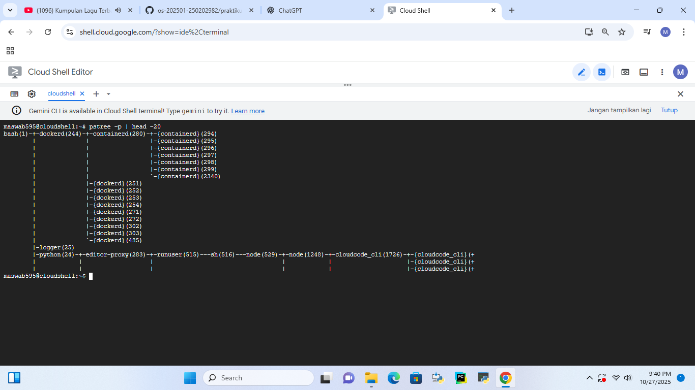

# Laporan Praktikum Minggu 4
Topik: Manajemen Proses dan User di Linux

---

## Identitas
- **Nama**  : Awwab Maftuhi
- **NIM**   : 250202920  
- **Kelas** : 1 IKRB

---

## Tujuan
Setelah menyelesaikan tugas ini, mahasiswa mampu:
1. Menjelaskan konsep proses dan user dalam sistem operasi Linux.  
2. Menampilkan daftar proses yang sedang berjalan dan statusnya.  
3. Menggunakan perintah untuk membuat dan mengelola user.  
4. Menghentikan atau mengontrol proses tertentu menggunakan PID.  
5. Menjelaskan kaitan antara manajemen user dan keamanan sistem.  

---

## Dasar Teori
**Ringkasan Teori yang Mendasari Percobaan**

1. **Konsep User dan Hak Akses** – Setiap pengguna dalam sistem operasi memiliki identitas dan hak akses berbeda untuk menjaga keamanan serta pembagian tugas dalam sistem.

2. **Proses dan PID (Process ID)** – Setiap program yang dijalankan menjadi proses dan diberi *PID* unik agar sistem dapat mengenali serta mengelolanya secara individual.

3. **Manajemen Proses** – Sistem operasi bertanggung jawab dalam membuat, menjalankan, menjadwalkan, dan menghentikan proses untuk menjaga efisiensi penggunaan sumber daya.

4. **Hierarki Proses (Parent–Child)** – Proses dapat memiliki hubungan induk–anak, di mana proses induk dapat membuat dan mengendalikan proses anak.

5. **Pemantauan Proses** – Perintah seperti `ps`, `grep`, dan `pstree` digunakan untuk memantau status, hubungan, dan aktivitas proses yang sedang berjalan.


---

## Langkah Praktikum
1. Langkah-langkah yang dilakukan.  
2. Perintah yang dijalankan.  
3. File dan kode yang dibuat.  
4. Commit message yang digunakan.

---

## Kode / Perintah
Tuliskan potongan kode atau perintah utama:
```bash
whoami
id
groups
```
sudo adduser praktikan
sudo passwd praktikan
```
ps aux | head -10
top -n 1
```
sleep 1000 &
ps aux | grep sleep
```
kill <PID>
ps aux | grep sleep
```
```
pstree -p | head -20
```
---

## Hasil eksekusi

### Eksperimen 1-Identitas user


| No | Perintah                         | Fungsi / Tujuan                                                       | Output yang Muncul                                                                           | Penjelasan                                                                                                       |
| -- | -------------------------------- | --------------------------------------------------------------------- | -------------------------------------------------------------------------------------------- | ---------------------------------------------------------------------------------------------------------------- |
| 1  | `whoami`                         | Menampilkan nama user yang sedang aktif/login                         | `maswab595`                                                                                  | Menunjukkan user yang sedang digunakan di shell adalah `maswab595`.                                              |
| 2  | `id`                             | Menampilkan UID (User ID), GID (Group ID), dan grup yang diikuti user | `uid=1000(maswab595) gid=1000(maswab595) groups=1000(maswab595),4(adm),27(sudo),996(docker)` | User `maswab595` memiliki ID unik `1000`, tergabung dalam grup `adm`, `sudo`, dan `docker`.                      |
| 3  | `groups`                         | Menampilkan daftar grup yang diikuti user                             | `maswab595 adm sudo docker`                                                                  | User `maswab595` tergabung di tiga grup penting: `adm` (akses log), `sudo` (hak admin), `docker` (akses Docker). |
| 4  | `sudo adduser praktikan`         | Menambahkan user baru bernama `praktikan`                             | `fatal: The user 'praktikan' already exists.`                                                | Gagal membuat user karena `praktikan` sudah ada di sistem.                                                       |
| 5  | `sudo passwd praktikan`          | Mengatur atau mengubah password user `praktikan`                      | `passwd: password updated successfully`                                                      | Password untuk user `praktikan` berhasil diperbarui.                                                             |
| 6  | `whoami`                         | Mengecek kembali user aktif                                           | `maswab595`                                                                                  | Masih login sebagai user `maswab595`, belum berpindah ke `praktikan`.                                            |
| 7  | `id`                             | Mengecek identitas user aktif                                         | Sama seperti sebelumnya                                                                      | Masih menunjukkan identitas user `maswab595`.                                                                    |
| 8  | `sudo adduser praktikan` (ulang) | Coba menambahkan user `praktikan` lagi                                | `fatal: The user 'praktikan' already exists.`                                                | Gagal karena user `praktikan` memang sudah ada.                                                                  |


### Eksperimen 2-monitoring proses


| **Kolom**   | **Keterangan / Nama Lengkap**      | **Fungsi / Makna**                                                                                        | **Contoh dari Output**                            |
| ----------- | ---------------------------------- | --------------------------------------------------------------------------------------------------------- | ------------------------------------------------- |
| **USER**    | Nama pengguna (User)               | Menunjukkan siapa pemilik atau yang menjalankan proses tersebut.                                          | `root`, `maswab595`, `syslog`                     |
| **PID**     | Process ID                         | Nomor unik yang diberikan sistem ke setiap proses yang berjalan.                                          | `1`, `11`, `280`, `524`                           |
| **%CPU**    | Persentase penggunaan CPU          | Menunjukkan berapa persen kapasitas CPU yang sedang digunakan oleh proses tersebut.                       | `0.0`, `1.2`, `5.3`                               |
| **%MEM**    | Persentase penggunaan memori (RAM) | Menunjukkan seberapa banyak memori yang digunakan oleh proses dibanding total memori yang tersedia.       | `0.1`, `0.3`, `1.5`                               |
| **VSZ**     | Virtual Memory Size                | Total ukuran memori virtual yang digunakan proses (dalam KB).                                             | `4248`, `1723904`                                 |
| **RSS**     | Resident Set Size                  | Jumlah memori fisik (RAM) yang benar-benar digunakan oleh proses (dalam KB).                              | `3488`, `7860`                                    |
| **TTY**     | Terminal Type                      | Menunjukkan terminal atau konsol tempat proses berjalan. Jika `?`, berarti proses berjalan di background. | `?`, `pts/0`                                      |
| **STAT**    | Status Proses                      | Menunjukkan kondisi proses saat ini: `R` (Running), `S` (Sleeping), `Z` (Zombie), `T` (Stopped), dll.     | `Ss`, `Sl`, `R+`                                  |
| **START**   | Waktu Mulai Proses                 | Waktu saat proses dimulai.                                                                                | `14:21`, `14:22`                                  |
| **TIME**    | CPU Time                           | Total waktu CPU yang telah digunakan proses sejak awal dijalankan.                                        | `00:00:00`, `00:01:23`                            |
| **COMMAND** | Nama perintah / program            | Menampilkan nama program atau perintah yang dijalankan proses tersebut.                                   | `/usr/bin/python3`, `/bin/bash`, `/usr/sbin/sshd` |


### Eksperimen 3-kontrol proses


| No | Perintah yang Dijalankan | Tujuan                                      | Hasil Output                                            | **PID Proses `sleep`**                                                                                                                 | Keterangan                               |                                                                                                                  |
| -- | ------------------------ | ------------------------------------------- | ------------------------------------------------------- | -------------------------------------------------------------------------------------------------------------------------------------- | ---------------------------------------- | ---------------------------------------------------------------------------------------------------------------- |
| 1  | `ps aux                  | grep sleep` (pertama)                       | Mencari proses yang berhubungan dengan perintah `sleep` | Menampilkan 3 proses terkait: <br>• `sleep infinity` (PID **483**) <br>• `sleep 1000` (PID **2371**) <br>• `grep sleep` (PID **2385**) | **483** dan **2371**                     | PID 483 adalah proses `sleep` milik `root`, sedangkan PID 2371 adalah proses `sleep` yang kamu jalankan sendiri. |
| 2  | `kill 2371`              | Menghentikan proses `sleep` dengan PID 2371 | `[1]+  Terminated  sleep 1000`                          | **2371 (terminated)**                                                                                                                  | Proses `sleep 1000` berhasil dihentikan. |                                                                                                                  |
| 3  | `ps aux                  | grep sleep` (ulang)                         | Mengecek kembali apakah proses `sleep` masih berjalan   | Hasil hanya menampilkan: <br>• `sleep infinity` (PID **483**) <br>• `grep sleep` (PID **2413**)                                        | **483**                                  | Proses `sleep 1000` sudah tidak ada (berhasil dihentikan). Proses `sleep infinity` milik root masih aktif.       |

PID proses sleep yang ditemukan: 483 dan 2371

PID yang dihentikan: 2371

PID yang masih aktif: 483 (/bin/bash /google/scripts/onrun.sh sleep infinity milik root)


### Eksperimen 4-analisis hierarki proses


#### Analisis Hierarki

Dari gambar terlihat struktur pohon proses seperti berikut (disederhanakan):


 ├─ dockerd(244)

 │   └─ containerd(280)

 │       ├─  

 │       ├─  

 │       └─ ...

 ├─ logger(25)

 ├─ python(24)

 └─ editor-proxy(283)
 
      └─ runuser(515)
           └─ sh(516)
                └─ node(529)
                     └─ node(1248)
                          └─ cloudcode_cli(1726)
                               ├─ [cloudcode_cli]
                               ├─ [cloudcode_cli]
                               └─ [cloudcode_cli]


| **Elemen**                                                                      | **PID**  | **Keterangan / Peran**                                                                                                                                                                                                                            |
| ------------------------------------------------------------------------------- | -------- | ------------------------------------------------------------------------------------------------------------------------------------------------------------------------------------------------------------------------------------------------- |
| `bash(1)`                                                                       | **1**    | Ini adalah **proses induk utama** (init) dalam lingkungan Cloud Shell. Biasanya, pada sistem Linux normal proses ini adalah **`systemd(1)`** atau **`init(1)`**, namun di Cloud Shell digantikan oleh **bash(1)** sebagai root shell environment. |
| `dockerd(244)`                                                                  | 244      | Proses daemon Docker — anak dari `bash(1)`; menjalankan container.                                                                                                                                                                                |
| `containerd(280)`                                                               | 280      | Proses manajer container (anak dari `dockerd`). Mengelola proses container seperti `[containerd](294–299, 2340)`.                                                                                                                                 |
| `logger(25)`                                                                    | 25       | Menangani pencatatan log sistem (syslog).                                                                                                                                                                                                         |
| `python(24)`                                                                    | 24       | Interpreter Python yang digunakan oleh layanan internal Cloud Shell.                                                                                                                                                                              |
| `editor-proxy(283)`                                                             | 283      | Proses proxy untuk Cloud Shell Editor.                                                                                                                                                                                                            |
| `runuser(515)` → `sh(516)` → `node(529)` → `node(1248)` → `cloudcode_cli(1726)` | 515–1726 | Rantai proses editor berbasis Node.js dan Cloud Code CLI. Semua ini berjalan di bawah `editor-proxy`.                                                                                                                                             |

##### Kesimpulan
| **Aspek**                       | **Hasil Identifikasi**                                                                                                                          |           |
| ------------------------------- | ----------------------------------------------------------------------------------------------------------------------------------------------- | --------- |
| **Perintah digunakan**          | `pstree -p                                                                                                                                      | head -20` |
| **Proses induk (init/systemd)** | `bash(1)`                                                                                                                                       |           |
| **Fungsi proses induk**         | Sebagai **parent/root process** yang memulai semua proses lain di lingkungan Cloud Shell (menggantikan `init`/`systemd` di sistem Linux biasa). |           |
| **Contoh proses anak**          | `dockerd(244)`, `containerd(280)`, `python(24)`, `logger(25)`, `editor-proxy(283)`                                                              |           |
| **Lingkungan eksekusi**         | Google Cloud Shell, sehingga hierarki dimulai dari shell user (`bash(1)`) bukan dari `systemd(1)` seperti pada server Linux penuh.              |           |

---

## Analisis

- jelaskan konsep proses dan user dalam sistem operasi Linux

   Dalam sistem operasi Linux,pengguna(user),dan proses memiliki peran yang saling berhubungan dan sama-sama penting.Seorang user berfungsi sebagai identitas untuk masuk dan menggunakan sistem,di mana setiap pengguna memiliki hak serta tanggung jawab yang berbeda—mulai dari pengguna biasa hingga administrator (root).Sementara itu,proses dapat diartikan sebagai program yang sedang dijalankan di memori dan dikontrol oleh kernel.Setiap proses memiliki nomor identitas unik(PID),status tertentu,serta prioritas dalam menjalankan tugasnya.Linux memungkinkan banyak pengguna bekerja secara bersamaan dengan menjalankan berbagai proses,berkat sistem multitasking yang efisien.Kernel berperan utama dalam mengatur pemakaian sumber daya seperti CPU,memori,dan berkas agar semua proses dapat berjalan stabil tanpa saling mengganggu.

- Jelaskan hubungan antara user management dan keamanan sistem Linux.  

   Dalam sistem operasi Linux,user management memiliki kaitan yang sangat erat dengan keamanan sistem. Setiap pengguna yang dibuat di dalam sistem memiliki hak akses berbeda,tergantung pada peran dan kebutuhannya.Melalui pengelolaan user yang baik,administrator dapat memastikan bahwa hanya orang tertentu yang bisa membuka atau mengubah file penting.Hal ini mencegah penyalahgunaan data dan tindakan yang bisa merusak sistem.
   Selain itu,Linux menyediakan berbagai perintah seperti chmod,chown,dan passwd untuk mengatur izin akses serta melindungi data dari pengguna yang tidak berwenang.Dengan sistem pengaturan tersebut,aktivitas setiap user dapat dibatasi sesuai tanggung jawabnya.Secara keseluruhan,manajemen user yang tepat menjadi salah satu kunci utama dalam menjaga keamanan,kestabilan,dan integritas sistem Linux.

- Jelaskan kaitan antara manajemen user dan keamanan sistem.

   Hubungan antara manajemen user dan keamanan sistem sangat erat karena pengaturan pengguna berfungsi sebagai langkah utama untuk melindungi data dan sumber daya komputer. Dalam sistem operasi seperti Linux, setiap pengguna diberikan hak akses tertentu yang menentukan apa saja yang bisa mereka lakukan terhadap file atau proses di dalam sistem. Dengan mengelola akun pengguna secara tepat—seperti membedakan peran, menetapkan izin yang sesuai, dan mengelompokkan pengguna berdasarkan tanggung jawab—administrator dapat mencegah terjadinya akses ilegal maupun penyalahgunaan sistem. Dengan demikian, manajemen user menjadi faktor penting dalam menjaga keamanan, kestabilan, dan keandalan sistem secara keseluruhan.


---

## Kesimpulan


Berdasarkan hasil praktikum, dapat disimpulkan bahwa Linux memiliki sistem pengelolaan user dan proses yang sangat penting untuk menjaga keamanan serta kinerja komputer. Melalui manajemen user, seorang administrator dapat menambahkan, menghapus, atau mengatur hak akses setiap pengguna sesuai kebutuhan agar sistem tetap aman. Sementara itu, manajemen proses memungkinkan pengguna untuk memantau dan mengontrol program yang sedang berjalan menggunakan perintah seperti ps, top, atau kill. Pemahaman terhadap kedua aspek ini membantu pengguna mengoptimalkan penggunaan sumber daya sistem, mencegah gangguan antarproses, serta menjaga stabilitas dan keandalan Linux secara keseluruhan.

---

## Quiz
1. Apa fungsi dari proses `init` atau `systemd` dalam sistem Linux?  

   **Jawaban:**  
               Proses **`init`** atau **`systemd`** merupakan **proses pertama (PID 1)** yang dijalankan setelah kernel aktif saat Linux mulai bekerja. Fungsinya adalah untuk **menjalankan, mengatur, dan mematikan berbagai layanan serta proses lain** di dalam sistem. Selain itu, `systemd` juga bertanggung jawab mengatur urutan saat sistem melakukan booting, memantau layanan yang berjalan, dan menangani proses yatim supaya sistem tetap stabil dan efisien. Tanpa adanya proses ini, sistem Linux tidak akan dapat berfungsi dengan baik.

2. Apa perbedaan antara `kill` dan `killall`?  
   **Jawaban:**  
               Perintah `kill` digunakan untuk menghentikan proses berdasarkan **nomor PID**.
               Sedangkan **`killall`** menghentikan **semua proses yang memiliki nama program yang sama**. Jadi, `kill` lebih spesifik ke satu proses tertentu, sementara `killall` lebih praktis jika ingin menutup beberapa proses sekaligus tanpa perlu tahu nomor PID-nya.

3. Mengapa user `root` memiliki hak istimewa di sistem Linux?  
   **Jawaban:**  
         User **`root`** memiliki hak istimewa karena berperan sebagai **administrator utama** di Linux. Akun ini punya **akses penuh ke seluruh sistem**, termasuk mengubah konfigurasi, mengelola file penting, dan mengatur pengguna lain. Kewenangan ini dibutuhkan untuk memelihara sistem, tetapi harus digunakan dengan hati-hati agar tidak menimbulkan kerusakan atau masalah keamanan.


---

## Refleksi Diri
Tuliskan secara singkat:
- Apa bagian yang paling menantang minggu ini?  

   Dalam beberapa materi,saya mulai merasakan kesulitan2 dari matkul sistem operasi.

- Bagaimana cara Anda mengatasinya?  

   Tetap belajar.
   Pintar dan paham itu bonus.Yang utama adalah kerja keras dan ketekunan.

---

**Credit:**  
_Template laporan praktikum Sistem Operasi (SO-202501) – Universitas Putra Bangsa_
