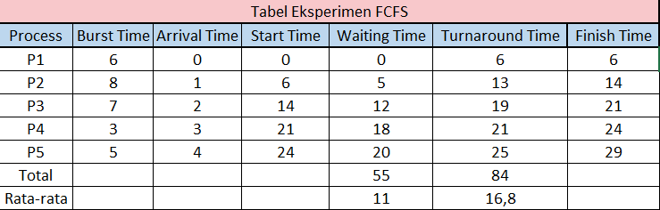
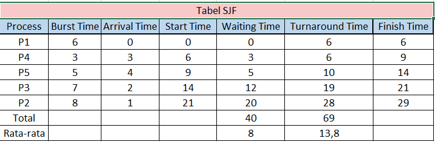

# Laporan Praktikum Minggu 5
Topik: Penjadwalan CPU – FCFS dan SJF  

---

## Identitas
- **Nama**  : Awwab Maftuhi
- **NIM**   : 250202920
- **Kelas** : 1 IKRB

---

## Tujuan
Setelah menyelesaikan tugas ini, mahasiswa mampu:
1. Menghitung *waiting time* dan *turnaround time* untuk algoritma FCFS dan SJF.  
2. Menyajikan hasil perhitungan dalam tabel yang rapi dan mudah dibaca.  
3. Membandingkan performa FCFS dan SJF berdasarkan hasil analisis.  
4. Menjelaskan kelebihan dan kekurangan masing-masing algoritma.  
5. Menyimpulkan kapan algoritma FCFS atau SJF lebih sesuai digunakan.  

---

## Dasar Teori

* **FCFS (First-Come, First-Served):** Algoritma ini mengeksekusi proses sesuai urutan kedatangannya. Proses yang tiba lebih dulu akan dilayani pertama kali, mirip antrian biasa.

* **Kelemahan FCFS:** Bersifat **non-preemptive** (tidak bisa diganggu) dan sering menyebabkan **Convoy Effect**, di mana proses pendek harus menunggu lama di belakang proses panjang.

* **SJF (Shortest Job First):** Algoritma ini mendahulukan proses dengan prediksi waktu eksekusi (CPU burst) terpendek untuk meminimalkan total waktu tunggu dalam sistem.

* **Kelebihan & Kelemahan SJF:** SJF terbukti **optimal** untuk waktu tunggu, namun sulit memprediksi waktu eksekusi secara akurat dan berisiko menyebabkan ***starvation*** pada proses panjang.
---

## Langkah Praktikum
1. **Siapkan Data Proses**
   Gunakan tabel proses berikut sebagai contoh (boleh dimodifikasi dengan data baru):
   | Proses | Burst Time | Arrival Time |
   |:--:|:--:|:--:|
   | P1 | 6 | 0 |
   | P2 | 8 | 1 |
   | P3 | 7 | 2 |
   | P4 | 3 | 3 |

2. **Eksperimen 1 – FCFS (First Come First Served)**
   - Urutkan proses berdasarkan *Arrival Time*.  
   - Hitung nilai berikut untuk tiap proses:
     ```
     Waiting Time (WT) = waktu mulai eksekusi - Arrival Time
     Turnaround Time (TAT) = WT + Burst Time
     ```
   - Hitung rata-rata Waiting Time dan Turnaround Time.  
   - Buat Gantt Chart sederhana:  
     ```
     | P1 | P2 | P3 | P4 |
     0    6    14   21   24
     ```

3. **Eksperimen 2 – SJF (Shortest Job First)**
   - Urutkan proses berdasarkan *Burst Time* terpendek (dengan memperhatikan waktu kedatangan).  
   - Lakukan perhitungan WT dan TAT seperti langkah sebelumnya.  
   - Bandingkan hasil FCFS dan SJF pada tabel berikut:

     | Algoritma | Avg Waiting Time | Avg Turnaround Time | Kelebihan | Kekurangan |
     |------------|------------------|----------------------|------------|-------------|
     | FCFS | ... | ... | Sederhana dan mudah diterapkan | Tidak efisien untuk proses panjang |
     | SJF | ... | ... | Optimal untuk job pendek | Menyebabkan *starvation* pada job panjang |

4. **Eksperimen 3 – Visualisasi Spreadsheet (Opsional)**
   - Gunakan Excel/Google Sheets untuk membuat perhitungan otomatis:
     - Kolom: Arrival, Burst, Start, Waiting, Turnaround, Finish.
     - Gunakan formula dasar penjumlahan/subtraksi.
   - Screenshot hasil perhitungan dan simpan di:
     ```
     praktikum/week5-scheduling-fcfs-sjf/screenshots/
     ```

5. **Analisis**
   - Bandingkan hasil rata-rata WT dan TAT antara FCFS & SJF.  
   - Jelaskan kondisi kapan SJF lebih unggul dari FCFS dan sebaliknya.  
   - Tambahkan kesimpulan singkat di akhir laporan.

6. **Commit & Push**
   ```bash
   git add .
   git commit -m "Minggu 5 - CPU Scheduling FCFS & SJF"
   git push origin main

---

## Kode / Perintah
Waiting Time (WT) = waktu mulai eksekusi - Arrival Time
Turnaround Time (TAT) = WT + Burst Time

---

## Hasil Eksekusi
Hasil eksperimen FCFS



---
Hasil eksperimen SJF



Hasil perbandingan FCFS dan SJF

  | Algoritma | Avg Waiting Time | Avg Turnaround Time | Kelebihan | Kekurangan |
   |------------|------------------|----------------------|------------|-------------|
  | FCFS | 11 | 16,8 | Sederhana dan mudah diterapkan | Tidak efisien untuk proses panjang |
  | SJF | 8 | 13,8 | Optimal untuk job pendek | Menyebabkan *starvation* pada job panjang |
---

## Analisis
- Bandingkan hasil rata-rata WT dan TAT antara FCFS & SJF. 

    Perbandingan Rata-Rata Waiting Time (WT) & Turnaround Time (TAT)
   Berdasarkan data eksperimen, algoritma SJF (Shortest Job First) menunjukkan kinerja yang jauh lebih unggul.

    FCFS:

    Rata-rata Waiting Time (AWT): (0+5+12+18+20) / 5 = 11.0
    Rata-rata Turnaround Time (ATAT): (6+13+19+21+25) / 5 = 16.8

     SJF (Non-Preemptive):

     Rata-rata Waiting Time (AWT): (0+20+12+3+5) / 5 = 8.0
     Rata-rata Turnaround Time (ATAT): (6+28+19+6+10) / 5 = 13.8

    Hasil ini menunjukkan SJF mampu mengurangi waktu tunggu rata-rata (AWT) sebesar 27.3% dan waktu penyelesaian rata-rata (ATAT) sebesar 17.9% dibandingkan FCFS untuk kumpulan proses yang sama.  

- Jelaskan kondisi kapan SJF lebih unggul dari FCFS dan sebaliknya.  
  
     SJF unggul dalam skenario di mana terdapat campuran proses dengan burst time yang bervariasi (pendek dan panjang), seperti pada data ini. Dengan mendahulukan proses terpendek (P4 dan P5), SJF berhasil menyelesaikan lebih banyak tugas dengan cepat. Hal ini secara drastis mengurangi waktu tunggu rata-rata bagi mayoritas proses dan mencegah terjadinya "Convoy Effect", di mana proses-proses singkat dipaksa menunggu selesainya satu proses panjang yang kebetulan tiba lebih dulu.

    FCFS pada dasarnya tidak pernah lebih unggul dari SJF dalam hal optimasi waktu tunggu. Namun, FCFS memiliki keunggulan dalam kesederhanaan implementasi karena tidak memerlukan prediksi burst time. Selain itu, FCFS bersifat adil dan menjamin tidak ada starvation; proses panjang (seperti P2) pasti akan dieksekusi, sementara dalam SJF, proses panjang berisiko terus-menerus "ditunda" jika proses-proses pendek baru terus berdatangan.

- Tambahkan kesimpulan singkat di akhir laporan.
  
    Data eksperimen ini secara jelas membuktikan bahwa SJF adalah algoritma yang lebih efisien dibandingkan FCFS untuk metrik kinerja waktu. Dengan memprioritaskan pekerjaan terpendek, SJF secara signifikan mengurangi Average Waiting Time dan Average Turnaround Time, yang mengarah pada throughput sistem yang lebih tinggi. Kelemahan utama FCFS adalah ketidakmampuannya menangani Convoy Effect, yang menyebabkan penumpukan antrian dan pemborosan waktu tunggu, seperti yang dialami oleh proses P4 dan P5 dalam tabel FCFS.

---

## Kesimpulan

 Penjadwalan CPU adalah proses pengaturan urutan eksekusi proses di CPU agar sumber daya CPU digunakan secara efisien. Penjadwalan yang baik harus mampu memaksimalkan utilisasi CPU, meningkatkan throughput, serta meminimalkan waktu tunggu, waktu respon, dan turnaround time dari proses yang dijalankan.
 Algoritma FCFS (First Come First Served) adalah metode penjadwalan CPU paling sederhana yang mengeksekusi proses berdasarkan urutan kedatangan. Meskipun mudah diimplementasikan, FCFS bisa menyebabkan waktu tunggu yang lama terutama jika ada proses dengan durasi eksekusi panjang, sehingga mengurangi kinerja sistem.

 Algoritma SJF (Shortest Job First) memilih proses dengan waktu eksekusi terpendek terlebih dahulu, sehingga mampu meminimalkan rata-rata waktu tunggu dan turnaround time dibanding FCFS. Oleh karena itu, SJF dianggap lebih optimal untuk efisiensi sistem, tetapi memiliki kelemahan seperti sulitnya memprediksi durasi proses dan potensi terjadinya kelaparan pada proses dengan durasi eksekusi panjang.​

 Singkatnya, SJF memberikan hasil yang lebih baik dari FCFS dalam banyak kasus penjadwalan CPU, terutama dalam mengurangi waktu tunggu dan meningkatkan efisiensi, namun implementasinya lebih kompleks dan kurang cocok untuk sistem yang memerlukan respons interaktif cepat.

---

## Quiz
1. Apa perbedaan utama antara FCFS dan SJF? 
   
   **Jawaban:**   

      Perbedaan utama antara FCFS (First Come First Served) dan SJF (Shortest Job First) adalah: FCFS melayani proses berdasarkan urutan kedatangan tanpa memperhatikan durasi proses, sedangkan SJF mengutamakan proses dengan waktu eksekusi terpendek terlebih dahulu. FCFS bersifat non-preemptive dan sederhana, tetapi dapat menyebabkan waktu tunggu lama terutama jika ada proses yang panjang. SJF, meskipun juga non-preemptive dalam versi dasarnya, memberikan prioritas pada proses yang lebih cepat sehingga lebih optimal dalam mengurangi waktu tunggu rata-rata.

2. Mengapa SJF dapat menghasilkan rata-rata waktu tunggu minimum?  
   **Jawaban:** 

      SJF dapat menghasilkan rata-rata waktu tunggu minimum karena algoritma ini selalu menjalankan proses yang memiliki durasi terpendek terlebih dahulu, sehingga proses cepat selesai tanpa harus menunggu lama. Ini mengurangi total waktu tunggu seluruh proses secara keseluruhan karena proses yang membutuhkan waktu singkat tidak terhambat oleh proses yang lebih lama.

3. Apa kelemahan SJF jika diterapkan pada sistem interaktif?
   
   **Jawaban:**  

      Kelemahan SJF ketika diterapkan pada sistem interaktif adalah sulitnya memprediksi durasi waktu eksekusi proses secara akurat dalam lingkungan real-time yang dinamis. Selain itu, SJF rentan menimbulkan kelaparan (starvation) bagi proses-proses yang memiliki durasi panjang, karena proses-proses dengan durasi pendek terus diutamakan sehingga proses panjang bisa terus menunggu tanpa mendapat giliran. Hal ini membuat SJF kurang cocok untuk sistem interaktif yang butuh respons cepat dan adil bagi semua proses.

---

## Refleksi Diri
Tuliskan secara singkat:
- Apa bagian yang paling menantang minggu ini?  
  > Laptop saya rusak sehingga saya tidak bisa mengerjakan tugas yang diberikan beberapa dosen.

- Bagaimana cara Anda mengatasinya? 
  > Untungnya saya mempunya teman yang dapat diajak kerjasama.
Sehingga saya mengerjakan tugas menggunakan laptop teman saya tersebut

---

**Credit:**  
_Template laporan praktikum Sistem Operasi (SO-202501) – Universitas Putra Bangsa_
