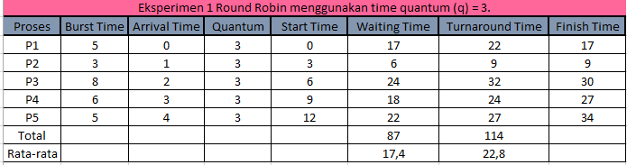
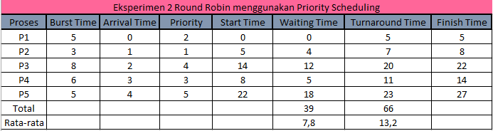

# Laporan Praktikum Minggu 6
Topik:  Penjadwalan CPU – Round Robin (RR) dan Priority Scheduling


---

## Identitas
- **Nama**  : Awwab Maftuhi
- **NIM**   : 250202920  
- **Kelas** : 1 IKRB

---

## Tujuan
Setelah menyelesaikan tugas ini, mahasiswa mampu:

1. Menghitung waiting time dan turnaround time pada algoritma RR dan Priority.
2. Menyusun tabel hasil perhitungan dengan benar dan sistematis.
3. Membandingkan performa algoritma RR dan Priority.
4. Menjelaskan pengaruh time quantum dan prioritas terhadap keadilan eksekusi proses.
5. Menarik kesimpulan mengenai efisiensi dan keadilan kedua algoritma.

---

## Dasar Teori
**Dasar Teori Penjadwalan CPU – Round Robin (RR) dan Priority Scheduling**

* Penjadwalan CPU mengatur urutan eksekusi proses agar penggunaan prosesor efisien dan adil.
* Round Robin (RR) memberi setiap proses waktu eksekusi tetap (time quantum) secara bergiliran.
* RR cocok untuk sistem time-sharing karena menjamin semua proses mendapat giliran.
* Priority Scheduling menjalankan proses berdasarkan tingkat prioritas tertinggi terlebih dahulu.
* Kelebihan RR adalah keadilan waktu, sedangkan Priority Scheduling lebih efisien untuk proses penting namun berisiko starvation jika tanpa mekanisme aging.


---

## Langkah Praktikum
1. **Siapkan Data Proses**
   Gunakan contoh data berikut (boleh dimodifikasi sesuai kebutuhan):
   | Proses | Burst Time | Arrival Time | Priority |
   |:--:|:--:|:--:|:--:|
   | P1 | 5 | 0 | 2 |
   | P2 | 3 | 1 | 1 |
   | P3 | 8 | 2 | 4 |
   | P4 | 6 | 3 | 3 |

2. **Eksperimen 1 – Round Robin (RR)**
   - Gunakan *time quantum (q)* = 3.  
   - Hitung *waiting time* dan *turnaround time* untuk tiap proses.  
   - Simulasikan eksekusi menggunakan Gantt Chart (manual atau spreadsheet).  
     ```
     | P1 | P2 | P3 | P4 | P1 | P3 | ...
     0    3    6    9   12   15   18  ...
     ```
   - Catat sisa *burst time* tiap putaran.

3. **Eksperimen 2 – Priority Scheduling (Non-Preemptive)**
   - Urutkan proses berdasarkan nilai prioritas (angka kecil = prioritas tinggi).  
   - Lakukan perhitungan manual untuk:
     ```
     WT[i] = waktu mulai eksekusi - Arrival[i]
     TAT[i] = WT[i] + Burst[i]
     ```
   - Buat tabel perbandingan hasil RR dan Priority.

4. **Eksperimen 3 – Analisis Variasi Time Quantum (Opsional)**
   - Ubah *quantum* menjadi 2 dan 5.  
   - Amati perubahan nilai rata-rata *waiting time* dan *turnaround time*.  
   - Buat tabel perbandingan efek *quantum*.

5. **Eksperimen 4 – Dokumentasi**
   - Simpan semua hasil tabel dan screenshot ke:
     ```
     praktikum/week6-scheduling-rr-priority/screenshots/
     ```
   - Buat tabel perbandingan seperti berikut:

     | Algoritma | Avg Waiting Time | Avg Turnaround Time | Kelebihan | Kekurangan |
     |------------|------------------|----------------------|------------|-------------|
     | RR | ... | ... | Adil terhadap semua proses | Tidak efisien jika quantum tidak tepat |
     | Priority | ... | ... | Efisien untuk proses penting | Potensi *starvation* pada prioritas rendah |

6. **Commit & Push**
   ```bash
   git add .
   git commit -m "Minggu 6 - CPU Scheduling RR & Priority"
   git push origin main
   ```
---

## Kode / Perintah

 WT[i] = waktu mulai eksekusi - Arrival[i]

 TAT[i] = WT[i] + Burst[i]

---

## Hasil Eksekusi
Eksperimen-1 Round Robin q(3)



Eksperime-2 Round Robin Priority Scheduling




---

## Analisis

Round Robin (RR) dan Priority Scheduling merupakan dua algoritma penjadwalan CPU yang memiliki karakteristik dan orientasi tujuan berbeda dalam sistem operasi.

Round Robin berorientasi pada keadilan (fairness), di mana setiap proses mendapat jatah waktu eksekusi yang sama dalam satuan time quantum. Pendekatan ini efektif untuk sistem time-sharing, karena memastikan tidak ada proses yang mendominasi CPU. Kelebihannya terletak pada respons time yang terprediksi dan distribusi waktu yang merata, namun kelemahannya muncul jika time quantum tidak diatur dengan tepat: terlalu kecil menyebabkan overhead tinggi akibat seringnya context switching, sedangkan terlalu besar mendekati perilaku First-Come, First-Served (FCFS) yang dapat menurunkan interaktivitas sistem.

Sebaliknya, Priority Scheduling menitikberatkan pada urgensi proses dengan memberikan CPU kepada proses yang memiliki prioritas tertinggi. Algoritma ini efisien untuk sistem yang membutuhkan respons cepat terhadap tugas-tugas kritis, seperti sistem real-time. Namun, kelemahannya adalah potensi starvation, yakni proses berprioritas rendah bisa tertunda lama atau bahkan tidak dieksekusi jika proses berprioritas tinggi terus datang. Masalah ini sering diatasi dengan teknik aging, di mana prioritas proses meningkat seiring waktu untuk menjamin keadilan.

Secara konseptual, Round Robin menonjol dalam aspek keadilan dan interaktivitas, sementara Priority Scheduling unggul dalam efisiensi dan kontrol terhadap proses penting. Kombinasi atau adaptasi keduanya sering diterapkan pada sistem modern untuk mencapai keseimbangan antara fairness dan efisiensi, menjadikannya dua pendekatan fundamental dalam desain penjadwalan CPU.

## Kesimpulan

Berdasarkan hasil praktikum mengenai algoritma penjadwalan Round Robin dan Priority Scheduling, dapat disimpulkan bahwa setiap metode memiliki keunggulan dan kelemahan yang saling melengkapi.

Algoritma Round Robin terbukti memberikan tingkat keadilan yang tinggi dalam pembagian waktu CPU, sehingga sangat sesuai diterapkan pada sistem multitasking interaktif yang menuntut respons cepat bagi setiap proses. Namun, performanya sangat dipengaruhi oleh ukuran time quantum yang digunakan.

Sementara itu, Priority Scheduling menunjukkan efisiensi tinggi dalam menangani proses dengan tingkat kepentingan berbeda, terutama pada sistem real-time yang membutuhkan penanganan segera terhadap proses prioritas tinggi. Akan tetapi, algoritma ini berpotensi menimbulkan starvation bagi proses dengan prioritas rendah jika tidak diimbangi dengan mekanisme seperti aging.

Dengan demikian, melalui praktikum ini dapat disimpulkan bahwa pemilihan algoritma penjadwalan harus disesuaikan dengan tujuan dan karakteristik sistem yang digunakan. Tidak ada algoritma yang sepenuhnya unggul dalam semua aspek, tetapi kombinasi prinsip keadilan dari Round Robin dan efisiensi dari Priority Scheduling dapat menghasilkan sistem penjadwalan yang optimal dan adaptif terhadap berbagai kebutuhan.

---

## Quiz
1. Apa perbedaan utama antara Round Robin dan Priority Scheduling?

   **Jawaban:**
   Perbedaan utama terletak pada dasar penentuan giliran eksekusi proses.
   Round Robin membagi waktu CPU secara merata menggunakan time quantum yang sama untuk setiap proses tanpa memperhatikan prioritasnya.
   Priority Scheduling, sebaliknya, memberikan CPU kepada proses dengan prioritas tertinggi terlebih dahulu, sehingga urutan eksekusi bergantung pada tingkat kepentingan proses, bukan urutan kedatangannya.
   Dengan kata lain, Round Robin menekankan keadilan waktu, sedangkan Priority Scheduling menekankan kepentingan proses.
2. Apa pengaruh besar/kecilnya time quantum terhadap performa sistem?

   **Jawaban:**
   Ukuran time quantum sangat memengaruhi respons time dan efisiensi sistem:

   Jika time quantum terlalu kecil, CPU akan sering melakukan context switching, menyebabkan overhead tinggi dan menurunkan efisiensi.

   Jika time quantum terlalu besar, sistem akan cenderung berperilaku seperti First-Come, First-Served (FCFS), sehingga proses yang datang belakangan harus menunggu lama dan respons time meningkat.

   Oleh karena itu, pemilihan time quantum harus seimbang agar sistem tetap responsif dan efisien.

3. Mengapa algoritma Priority dapat menyebabkan starvation?

   **Jawaban:**

   Algoritma Priority Scheduling dapat menyebabkan starvation karena proses dengan prioritas rendah bisa tidak pernah mendapatkan giliran CPU apabila selalu ada proses baru dengan prioritas lebih tinggi yang datang. Akibatnya, proses berprioritas rendah akan terus tertunda atau bahkan tidak dieksekusi sama sekali.
   Masalah ini biasanya diatasi dengan aging, yaitu peningkatan prioritas secara bertahap terhadap proses yang sudah lama menunggu, agar tetap mendapat kesempatan untuk dieksekusi.

---

## Refleksi Diri
Tuliskan secara singkat:
- Apa bagian yang paling menantang minggu ini?  
  
  Alhamdulillah masih belum ada karena saya mengerjakannya kelompok dengan orang ambis.

- Bagaimana cara Anda mengatasinya? 

  nothing
 

---

**Credit:**  
_Template laporan praktikum Sistem Operasi (SO-202501) – Universitas Putra Bangsa_
