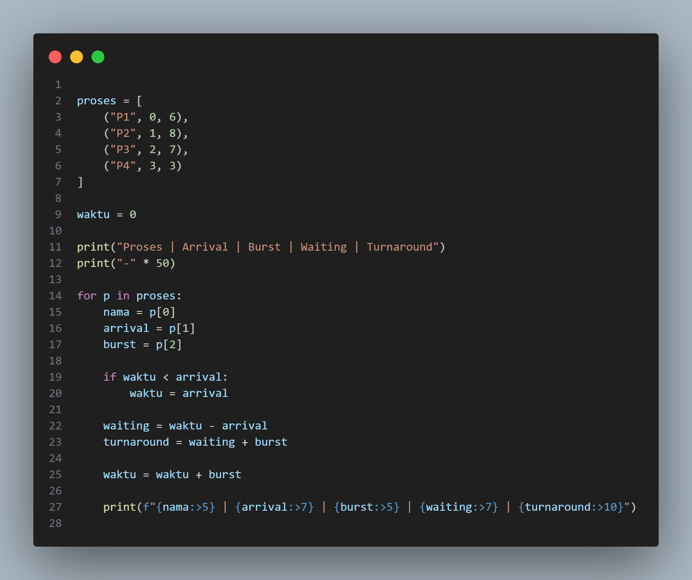
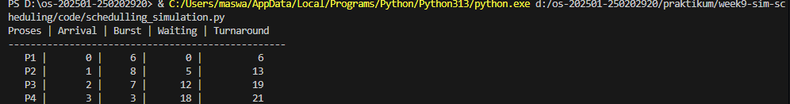

# Laporan Praktikum Minggu 9
Topik: Simuasi Penjadwalan Algoritma CPU

---

## Identitas
- **Nama**  : Awwab Maftuhi
- **NIM**   : 250202920 
- **Kelas** : 1 IKRB

---

## Tujuan
Setelah menyelesaikan tugas ini, mahasiswa mampu:
1. Membuat program simulasi algoritma penjadwalan FCFS dan/atau SJF.  
2. Menjalankan program dengan dataset uji yang diberikan atau dibuat sendiri.  
3. Menyajikan output simulasi dalam bentuk tabel atau grafik.  
4. Menjelaskan hasil simulasi secara tertulis.  
5. Mengunggah kode dan laporan ke Git repository dengan rapi dan tepat waktu.

---

## Dasar Teori
Penjadwalan CPU adalah proses pengaturan urutan eksekusi proses oleh sistem operasi agar penggunaan CPU menjadi optimal. Simulasi penjadwalan CPU digunakan untuk memodelkan cara kerja algoritma penjadwalan sehingga dapat dianalisis tanpa diterapkan langsung pada sistem nyata.

Algoritma First Come First Serve (FCFS) mengeksekusi proses berdasarkan urutan kedatangan. Algoritma ini bersifat non-preemptive dan mudah diimplementasikan, namun dapat menyebabkan waktu tunggu yang lama.

Algoritma Shortest Job First (SJF) mengeksekusi proses dengan waktu eksekusi terpendek terlebih dahulu. Algoritma ini lebih efisien dalam meminimalkan waktu tunggu rata-rata, tetapi berpotensi menyebabkan starvation.

Simulasi penjadwalan menggunakan Python membantu memahami kinerja algoritma FCFS dan SJF melalui perhitungan waktu tunggu dan waktu penyelesaian proses.

---

## Langkah Praktikum
1. **Menyiapkan Dataset**

   Buat dataset proses minimal berisi:

   | Proses | Arrival Time | Burst Time |
   |:--:|:--:|:--:|
   | P1 | 0 | 6 |
   | P2 | 1 | 8 |
   | P3 | 2 | 7 |
   | P4 | 3 | 3 |

2. **Implementasi Algoritma**

   Program harus:
   - Menghitung *waiting time* dan *turnaround time*.  
   - Mendukung minimal **1 algoritma (FCFS atau SJF non-preemptive)**.  
   - Menampilkan hasil dalam tabel.

3. **Eksekusi & Validasi**

   - Jalankan program menggunakan dataset uji.  
   - Pastikan hasil sesuai dengan perhitungan manual minggu sebelumnya.  
   - Simpan hasil eksekusi (screenshot).

4. **Analisis**

   - Jelaskan alur program.  
   - Bandingkan hasil simulasi dengan perhitungan manual.  
   - Jelaskan kelebihan dan keterbatasan simulasi.

5. **Commit & Push**

   ```bash
   git add .
   git commit -m "Minggu 9 - Simulasi Scheduling CPU"
   git push origin main
---


---

## Hasil Eksekusi

 1.  **Dataset proses:**

   | Proses | Arrival Time | Burst Time |
   | :----: | :----------: | :--------: |
   |   P1   |       0      |      6     |
   |   P2   |       1      |      8     |
   |   P3   |       2      |      7     |
   |   P4   |       3      |      3     |
   |   P5   |       4      |      4     |
   |   P6   |       6      |      2     |

2. **Implementasi Algoritma**



3. **Eksekusi dan Validasi**



4. **Analisis**

    ***Alur Program***
   - Program dimulai dengan mendefinisikan dataset proses yang berisi ID proses, arrival time, dan burst time.
    - Selanjutnya, program menginisialisasi variabel waktu untuk melacak waktu eksekusi CPU.
   Program kemudian memproses setiap proses secara berurutan sesuai algoritma FCFS. Untuk setiap proses, program menghitung waiting time berdasarkan selisih antara waktu mulai eksekusi dengan arrival time, serta menghitung turnaround time sebagai penjumlahan waiting time dan burst time. Hasil perhitungan ditampilkan dalam bentuk tabel.

   - ***Perbandingan Hasil Simulasi dengan Hitungan Manual***

   >
      Hasil simulasi menunjukkan nilai waiting time dan turnaround time yang sama dengan hasil perhitungan manual yang telah dilakukan sebelumnya. Urutan eksekusi proses sesuai dengan prinsip FCFS, yaitu berdasarkan urutan kedatangan proses. Hal ini membuktikan bahwa algoritma yang diimplementasikan pada program berjalan dengan benar.

   - ***Kelebihan dan Keterbatasan Simulasi***

   >
   *Kelebihan:*

   ~ Mudah dipahami dan diimplementasikan

   ~ Mempercepat perhitungan dibandingkan perhitungan manual

   ~ Mengurangi risiko kesalahan hitung

   *Keterbatasan*:

   ~ Hanya mendukung satu algoritma penjadwalan

   ~ Tidak menangani proses preemptive

   ~ Dataset masih dimasukkan secara statis di dalam program


  

---

## Kesimpulan

1. Simulasi algoritma penjadwalan CPU menggunakan metode FCFS berhasil dijalankan dengan baik dan menghasilkan nilai waiting time serta turnaround time yang sesuai dengan perhitungan manual.

2. Penggunaan simulasi berbasis Python mempermudah proses analisis penjadwalan CPU karena perhitungan dapat dilakukan secara otomatis, cepat, dan mengurangi kesalahan perhitungan.

3. Meskipun mudah diimplementasikan, algoritma FCFS memiliki keterbatasan karena dapat menghasilkan waktu tunggu yang besar, sehingga kurang optimal untuk sistem dengan banyak proses berdurasi panjang.

---

## Quiz
1. Mengapa simulasi diperlukan untuk menguji algoritma scheduling? 
   
   **Jawab:** Simulasi diperlukan untuk menguji algoritma scheduling karena memungkinkan evaluasi kinerja algoritma secara aman dan efisien tanpa harus diterapkan langsung pada sistem nyata, serta memudahkan perbandingan hasil seperti waiting time dan turnaround time.


2. Apa perbedaan hasil simulasi dengan perhitungan manual jika dataset besar?

   **Jawab:** Jika dataset berukuran besar, perbedaan utama antara simulasi dan perhitungan manual adalah efisiensi dan potensi kesalahan, bukan pada hasil akhirnya.
   Simulasi dapat menghitung hasil dengan cepat, konsisten, dan minim kesalahan meskipun jumlah proses sangat banyak, sedangkan perhitungan manual menjadi lambat, tidak praktis, dan rawan kesalahan hitung. Secara teori, hasil simulasi dan perhitungan manual tetap sama jika algoritma yang digunakan benar.

3. Algoritma mana yang lebih mudah diimplementasikan? Jelaskan.

   **Jawab:** Algoritma **FCFS (First Come First Serve)** lebih mudah diimplementasikan dibandingkan SJF karena proses dijalankan langsung berdasarkan urutan kedatangan tanpa perlu perhitungan atau pemilihan burst time terpendek. Struktur programnya sederhana dan tidak memerlukan estimasi waktu eksekusi, sehingga cocok untuk pemula.

 

---

## Refleksi Diri
Tuliskan secara singkat:
- Apa bagian yang paling menantang minggu ini?  
> my laptop is bad
- Bagaimana cara Anda mengatasinya?  
>praying lonely for my god

---

**Credit:**  
_Template laporan praktikum Sistem Operasi (SO-202501) – Universitas Putra Bangsa_
